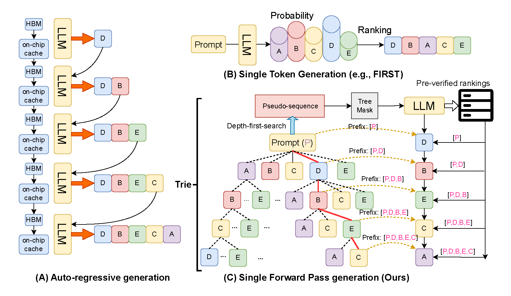
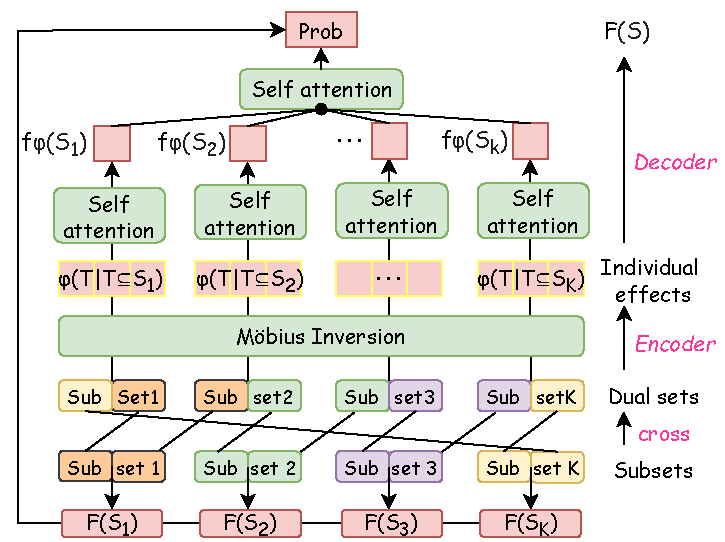

# ONE-PASS
---
This repository contains the source code for **ONE-PASS: Single Forward Pass Decoding for Listwise Reranking**, which is subbimted for peer review. The overall architecture is shown as follows:

<!--   -->
|  |  |
|:--:|:--:|

 
---

### Requirement:
```python
transformers==4.50.0
torch==2.5.1
```

## Workflow
The following steps outline the process for data_prepare, training and evaluate ONE-PASS:

### Step 1: Data preprocessing
Get the auto-regressive ranking generated by the target LLM for fast training and evaluation:

- `./dataset/dataset_processing_Llama.ipynb`  (Already included in this repository, you can skip it)

### Step 2: Training and evaluation 
-  run `bash run.sh` with different settings.
-  See result in './log/$dataset/$backbone/$model_name', including log and model_save
 

## Ablation studies.
You can select dataset = ("rank_zephyr_IR_20" "quora_25" "ml-1m_25" "Games_25")  with variant as follows:
- --variant 'Permutation' 
- --variant 'Naive_add' 
- --variant 'wo_HAS'
- --variant ''wo_Mobius-1' 
- --variant ''wo_Mobius-2' 
- --variant ''ONE-PASS'
---
## baseline methods.
### Speculative methods:
Speculative Decoding Method, Blockwise, Medusa, and Parallel Decoding Method. 
For fair comparison, we directly rank the unaccepted items based on the logits of the last pass forward when SD-based methods reach a comparable latency to ours (usually 2-times pass forward of LLMs). The effectiveness and efficiency comparison as well as Accuracy–Latency Pareto Frontier analysis are shown in Figure 4.
```python
python baseline_Blockwise.py --data_name rank_zephyr_IR_20 --backbone Llama-3.2-3B-Instruct --n_step=2 # Blockwise
python baseline_Mesuda.py --data_name rank_zephyr_IR_20 --backbone Llama-3.2-3B-Instruct --n_step=2 # Medusa
python baseline_speculative_decoding.py --data_name rank_zephyr_IR_20 --backbone Llama-3.2-3B-Instruct --n_step=2 # SDM
python baseline_Parallel_Decoding.py --data_name rank_zephyr_IR_20 --backbone Llama-3.2-3B-Instruct --n_step=2  # PDM
```
### Training for Rankzephyr and FIRST
RankZephyr and FIRST are not directly designed to approximate auto-regressive decoding in ranking tasks; therefore, simply adopting their training strategies would lead to an unfair comparison. To address this issue, we retrain these two methods using rankings generated by the target LLM as the ground truth, ensuring that they share the same training data as our method. Specifically, RankZephyr is trained via supervised fine-tuning (SFT) on the ground-truth rankings (Equation (1) in [24]), while FIRST incorporates an additional learning-to-rank objective to account for the correctness of relative passage order (Equation (2) in [24]). We implement the SFT-based versions of RankZephyr and FIRST using the well-known framework torchtune.

Required
```python
torchtune # release/0.5.0 !!!
```
First, set output_dir based on your preference (FIRST or Rankzephyr), then for training.
#### Rankzephyr (training)
```python
 torchrun --nproc_per_node 4 full_finetune_distributed.py --config 3B_full.yaml # set  RankNet: False in 3B_full.yaml
```
#### FIRST (training)
```python
 torchrun --nproc_per_node 4 full_finetune_distributed.py --config 3B_full.yaml # set  RankNet: True in 3B_full.yaml
```
### Evaluation for Rankzephyr and FIRST
The original RankZephyr is designed with an auto-regressive decoding strategy, which is misaligned with the fast decoding objective. In [24], a single-token decoding strategy is adopted for RankZephyr; that is, a candidate is assumed to agree with the ranking implied by its computed logit at the first (top-rank) token position. Following this setting, we adopt the same decoding strategy in our paper. The source code for this decoding process can be executed as follows:

```python 
 python evaluate_SFT --data_name quora_25  --backbone Llama-3.2-3B-Instruct --mode FIRST   model_path "./SFT_models/Llama-3.2-3B-Instruct/FIRST"
 python evaluate_SFT --data_name quora_25  --backbone Llama-3.2-3B-Instruct --mode rankzephyr  model_path ./SFT_models/Llama-3.2-3B-Instruct/rankzephyr
```
